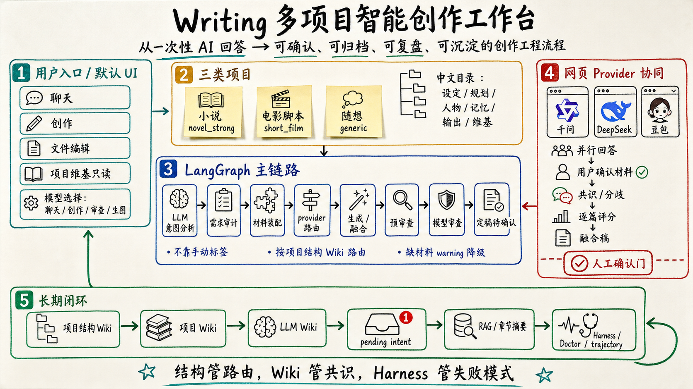
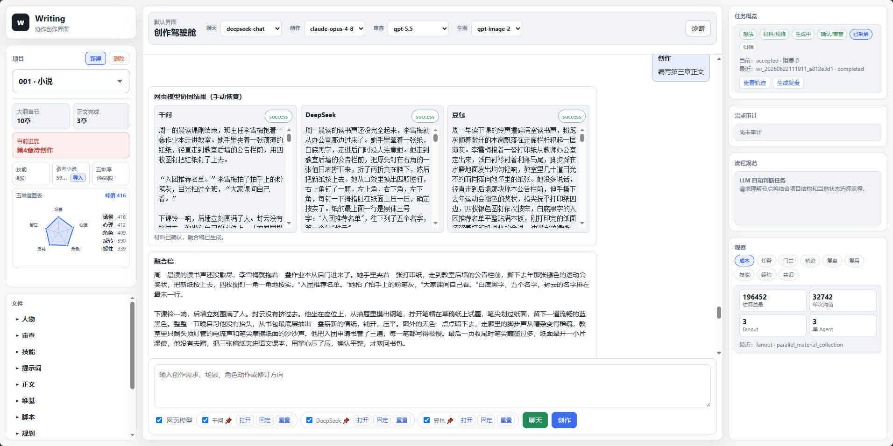
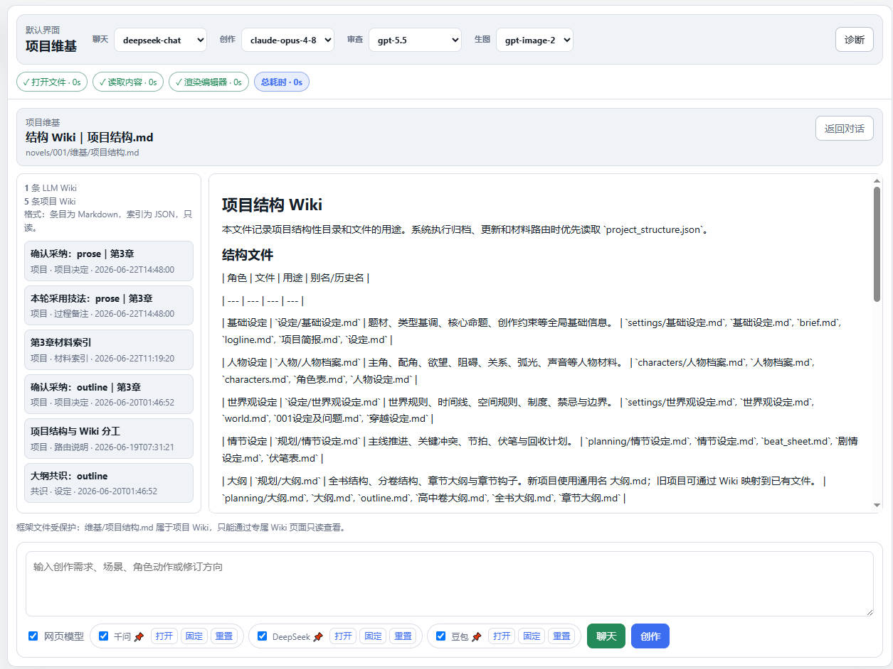
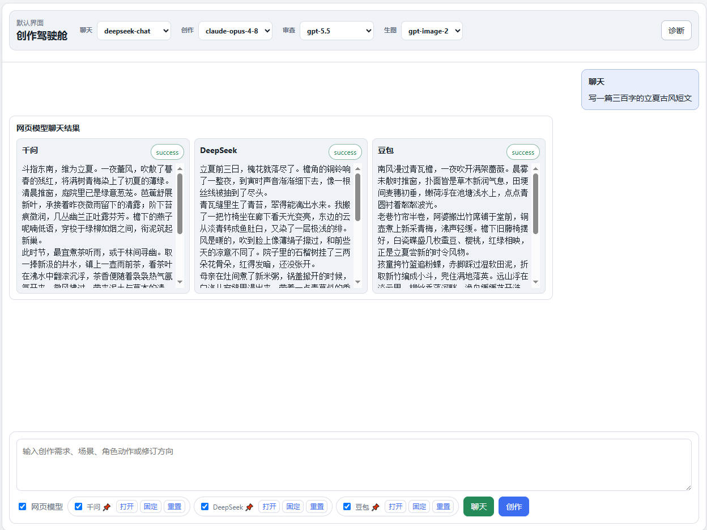
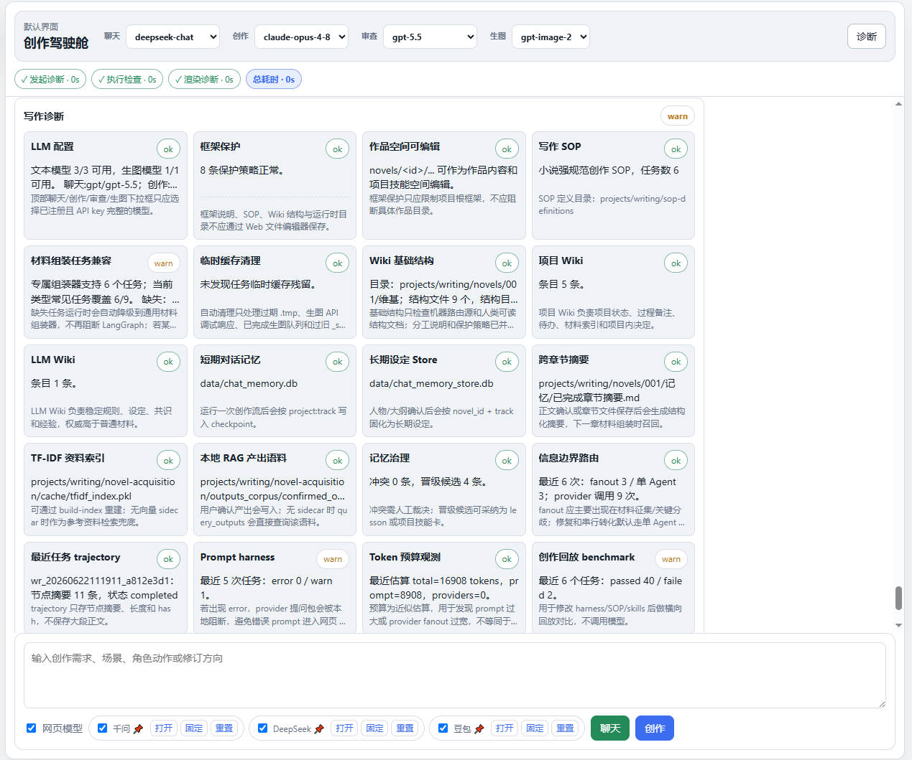
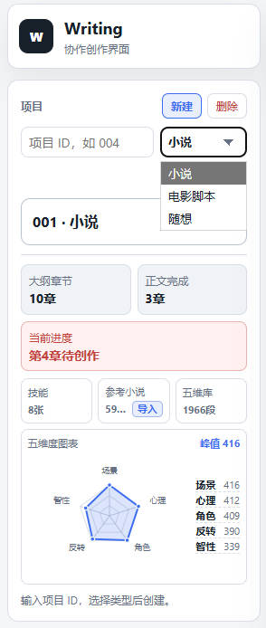
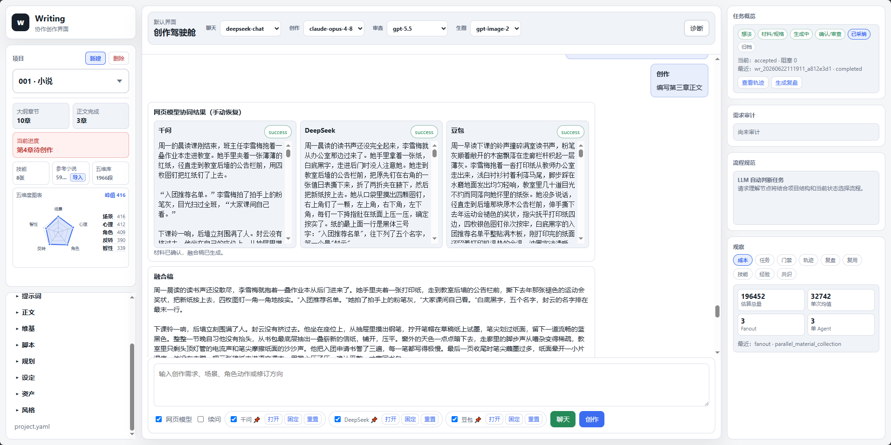
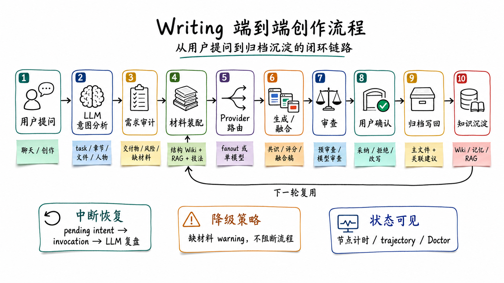
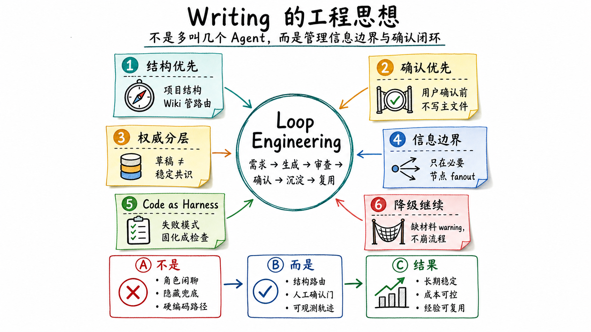
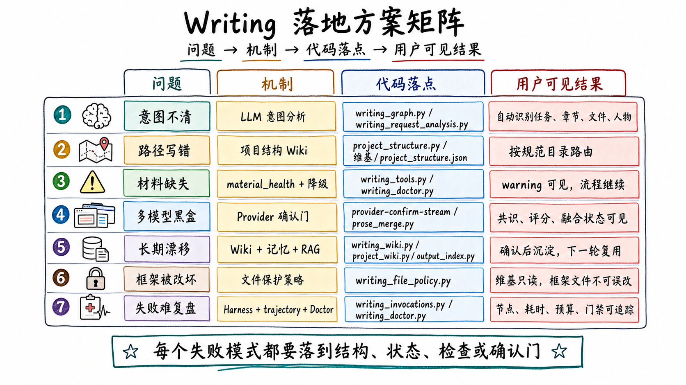

# Agentic Writing Workbench

**English** | [中文](README.zh-CN.md)

[](LICENSE)

Agentic Writing Workbench is a local-first creative writing workbench for long-form projects. It turns an open-ended writing request into an auditable workflow: understand intent, route by project structure, assemble precise materials, generate or collect candidates, review, ask for human confirmation, and only then write back to project files.

It is built with FastAPI, LangGraph, LangChain-compatible model clients, optional browser-based AI providers, project Wiki, recoverable task state, and reusable writing skill libraries.



## Problems It Solves

- Creative projects lose context across long conversations, files, and revisions.
- LLMs often answer from incomplete or irrelevant material.
- Browser AI providers are useful but difficult to coordinate, compare, and archive.
- Generated text should not silently overwrite outlines, chapters, scripts, or project rules.
- Reference novels, writing techniques, project memory, and review criteria need a repeatable way to enter the workflow.

This workbench treats writing as a controlled production pipeline, not a one-shot chat.

## Workbench Preview

| Writing cockpit | Project Wiki |
|---|---|
|  |  |

| Provider collection | Diagnostics |
|---|---|
|  |  |

| Project types | Prose creation |
|---|---|
|  |  |

## Core Ideas

- **Project structure first**: every project owns a `维基/project-structure.json` map. Routing and archive logic should read structure before guessing paths.
- **Intent before execution**: user requests first go through intent analysis, then enter the right workflow node.
- **Material precision**: prompts are assembled from relevant chapter, character, plot, style, memory, reference, and technique material instead of dumping whole files.
- **Human confirmation gate**: generated drafts, provider materials, file rewrites, and archive actions require explicit user confirmation.
- **Recoverable workflows**: pending tasks, stage timing, provider results, and confirmation states can be restored after refresh or restart.
- **Local ownership**: keys, browser sessions, private novels, generated outputs, logs, and memories stay local and are ignored by Git.

## Overall Framework

```text
Web UI
  -> FastAPI endpoints / SSE streams
  -> LangGraph writing workflow
  -> Project Wiki + SOP + pending intent memory
  -> Material assembly + RAG/five-dimension/reference retrieval
  -> Local LLM roles and optional browser providers
  -> Review, merge, finalization
  -> Human confirmation
  -> Archive/writeback + memory/wiki update
```

The UI supports three project types:

| Type | Purpose |
|---|---|
| Novel | Settings, characters, outline, chapter prose, continuity memory, review and archive |
| Short film | Concept, beat sheet, screenplay, storyboard prompts, character visual consistency, image generation |
| Casual | Notes, ideas, drafts, and reference material |

## Workflow And Engineering Boards

| Creation workflow | Engineering principles |
|---|---|
|  |  |

| Implementation matrix |
|---|
|  |

## Technical Route

- **Backend**: FastAPI + SSE for streaming workflow events and status updates.
- **Workflow engine**: LangGraph StateGraph for intent analysis, routing, material assembly, provider fanout, review, finalization, and archive.
- **Model layer**: OpenAI-compatible text/image model registry configured through `.env.shared`.
- **Provider layer**: optional Playwright browser automation for web AI providers, with user confirmation before fusion.
- **Memory and recovery**: pending intent memory, invocation logs, project Wiki, and workflow status snapshots.
- **Knowledge layer**: project Wiki, LLM Wiki, writing technique knowledge, public skill suites, optional Chroma/Embedding sidecars, and local TF-IDF fallback.
- **Frontend**: static HTML/CSS/JS workbench with project cards, file tree, read-only Wiki viewer, model selectors, task status timeline, and confirmation controls.

## Repository Contents

```text
app/                         FastAPI app, LangGraph workflow, model clients, writing modules
app/static-writing/          Default Web UI
docs/images/                 README diagrams and screenshots
projects/writing/            Writing workspace
projects/writing/novels/     Three initialized empty projects
projects/writing/data/       Public writing technique knowledge
projects/writing/novel-skill-suite/
projects/writing/short-film-skill-suite/
projects/writing/novel-acquisition/
scripts/validate-writing-project.py
```

The clean export does not include private keys, provider sessions, browser profiles, reference novels, Chroma data, task logs, generated outputs, or project-specific content.

## Quick Start

```powershell
python -m venv .venv
.\.venv\Scripts\python.exe -m pip install -r requirements.txt
.\.venv\Scripts\python.exe -m playwright install chromium
Copy-Item .env.shared.example .env.shared
notepad .env.shared
.\.venv\Scripts\python.exe -m uvicorn app.writing_web:app --host 127.0.0.1 --port 7861
```

Open:

```text
http://127.0.0.1:7861/
```

More details: [QUICK-START.md](QUICK-START.md).

## Configuration

`.env.shared.example` contains the model registry format:

- `LLM_KEYS`: text models.
- `LLM_ROLE_CHAT`: default chat model.
- `LLM_ROLE_WRITING`: default writing model.
- `LLM_ROLE_REVIEW`: default review model.
- `IMAGE_LLM_KEYS`: image models.
- `IMAGE_LLM_ROLE_IMAGE`: default image model.

Image defaults are `16:9`, `1K`, and `1536x1024`. Fill in your own endpoints and keys locally.

## Optional Vector Sidecar

ChromaDB and the Embedding service are optional. Leave these fields blank to disable vector search:

```dotenv
CHROMA_URL=
EMBEDDING_URL=
```

When disabled, the workbench still runs:

- Confirmed outputs are written to `projects/writing/novel-acquisition/outputs-corpus/confirmed_outputs.json`.
- Reference retrieval can use local TF-IDF / exact five-dimension search.
- Diagnostics may show the vector sidecar as unavailable, but the writing workflow should degrade instead of blocking.

To enable vector retrieval through a remote sidecar, open an SSH tunnel and fill in the local endpoints:

```powershell
ssh -L 8000:127.0.0.1:8000 -L 8001:127.0.0.1:8001 <user@your-sidecar-host>
# ChromaDB http://127.0.0.1:8000 | Embedding http://127.0.0.1:8001/embed
```

```dotenv
CHROMA_URL=http://127.0.0.1:8000
EMBEDDING_URL=http://127.0.0.1:8001/embed
CHROMA_TENANT=default_tenant
CHROMA_DATABASE=default_database
```

## Validation

```powershell
.\.venv\Scripts\python.exe scripts\validate-writing-project.py
node --check app\static-writing\app.js
```

## License And Trademarks

Code and documentation text are released under the [MIT License](LICENSE).

The project name, README diagrams, screenshots, and visual presentation are brand assets. See [TRADEMARKS.md](TRADEMARKS.md).

This repository is prepared as a clean framework export. It keeps reusable code, templates, public skill files, public writing technique knowledge, images, and empty project scaffolds.
