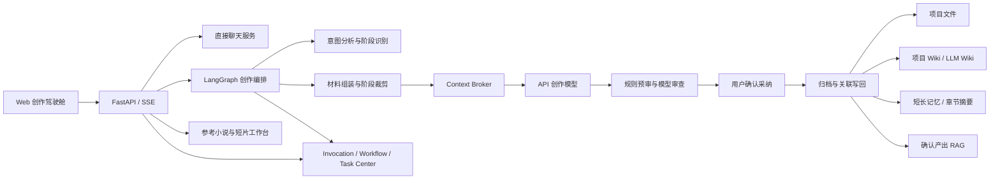
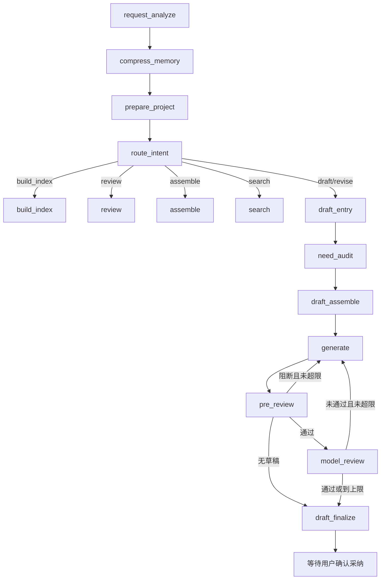
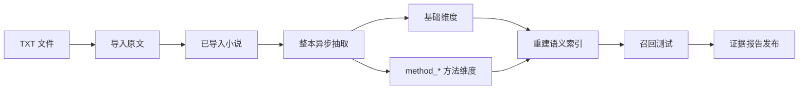

# Writing 多项目智能创作工作台详细设计

> 文档状态：当前实现基线
> 更新日期：2026-07-10
> 适用范围：`app/writing_*`、`app/project_*`、参考小说/短片视觉流、`app/static-writing/` 与 `projects/writing/` 运行资料
> 事实来源：当前代码、CodeGraph 查询、项目 README、SOP、TRD、记忆与 RAG 设计文档

## 1. 文档目的

本文描述 Writing 项目的当前详细设计，回答以下问题：

- 系统由哪些层和模块组成，各自负责什么。
- 用户提问如何从 Web UI 进入 LangGraph，再到材料组装、生成、审查、确认与归档。
- 项目类型、项目路径、任务状态、上下文和记忆分别以什么为唯一来源。
- Wiki、RAG、短期/长期记忆、Context Broker 如何协作且避免信息污染。
- 参考小说工作台、短片生词/生图如何接入主系统。
- 系统如何处理并发、失败、恢复、幂等、文件保护和信息边界。
- 后续新增项目类型、流程节点、上下文来源和模型时应从哪里扩展。

本文侧重“当前代码如何工作”。README 继续承担启动、使用和操作说明；TRD 继续承担单次需求的改动边界。

## 2. 系统定位与设计目标

Writing 是本地运行的多项目智能创作工作台，不是一次性文本生成页面。系统面向长期创作项目，核心目标是：

1. 先理解用户真实意图，再选择任务和创作阶段。
2. 只装配当前任务需要的材料，避免全项目资料无差别进入 prompt。
3. 使用 API 模型承担聊天、创作、审查和意图分析角色。
4. 在用户确认前保持草稿隔离，不污染主文件、长期记忆和高权威 Wiki。
5. 任务中断、刷新或服务重启后仍能恢复上下文和下一步动作。
6. 将确认产出沉淀到项目文件、章节摘要、Wiki、RAG 和调用轨迹。
7. 小说、电影脚本、随想共用流程骨架，类型差异由结构、SOP、profile 和 adapter 表达。

### 2.1 非目标

- 不把聊天按钮隐式升级成创作流程。
- 不让前端 DOM 成为任务恢复或项目结构的真相源。
- 不在用户确认前自动覆盖作品主文件。
- 不把无关材料、参考小说原文或本地路径发送给外部模型。
- 不用单项目 ID、单文件名或单次失败写业务硬编码。
- 不强依赖 ChromaDB/Embedding sidecar；不可用时允许本地降级。

## 3. 设计原则

| 原则 | 设计约束 | 主要落点 |
| --- | --- | --- |
| 结构优先 | 路由和归档先读项目结构 Wiki | `project_structure.py`、项目 `维基/project-structure.json` |
| 类型通用 | 三类项目共用骨架，差异进入配置和 adapter | `project_kinds.py`、SOP、stage profile |
| 确认后写入 | 未确认稿不进入主文件和长期记忆 | `draft_finalize`、`writing_web.py` 确认/归档链 |
| 状态可恢复 | pending、checkpoint、invocation 共同提供恢复能力 | `pending_intent_memory.py`、`writing_memory.py`、`writing_invocations.py` |
| 上下文可审计 | 材料有 required/preferred、预算、selected/dropped 和 trace | `writing_context_broker.py` |
| 失败可降级 | 缺材料、专属组装器不支持、sidecar 不可用时不让流程无故中断 | `writing_tools.py`、`output_index.py` |
| 兼容层隔离 | 中文路径优先，旧英文/下划线入口只在兼容层回退 | `project_paths.py`、SOP/知识库双文件名兼容 |
| 可观测 | 节点、耗时和门禁均可追踪 | invocation、workflow status、trajectory、review packet |

## 4. 技术基线与代码规模

### 4.1 技术栈

| 类别 | 技术 | 用途 |
| --- | --- | --- |
| Web | FastAPI、Uvicorn | HTTP API、SSE、静态资源托管 |
| 工作流 | LangGraph | 状态图、条件路由、审查回环、checkpoint |
| 模型 | LangChain、ChatOpenAI 兼容接口 | 聊天、创作、审查、意图分析 |
| 持久化 | SQLite、JSON、JSONL、Markdown | checkpoint、长期 Store、任务状态、Wiki、作品文件 |
| 检索 | ChromaDB、Embedding sidecar、TF-IDF、jieba、FAISS | 参考材料与确认产出召回 |
| 配置 | Pydantic、python-dotenv、YAML | 模型注册表、请求校验、SOP |
| 前端 | 原生 HTML/CSS/JavaScript | 单页创作驾驶舱 |

### 4.2 当前规模快照

- `app/` 下约 80 个 Python 模块、约 25,000 行 Python。
- `app/static-writing/app.js` 约 5,700 行。
- `app/static-writing/styles.css` 约 1,700 行。
- `app/writing_web.py` 暴露约 82 个 HTTP 路由。

这些数字用于理解系统复杂度，不作为固定交付指标。

## 5. 总体架构



### 5.1 分层职责

| 层 | 职责 | 代表模块 |
| --- | --- | --- |
| 表现层 | 项目、文件、对话、状态、工作台和观察面板 | `app/static-writing/` |
| Web 契约层 | 请求校验、API、SSE、文件安全、确认与归档入口 | `writing_web.py` |
| 编排层 | 状态图、节点顺序、条件路由、审查回环 | `writing_graph.py`、`writing_stream.py` |
| 领域服务层 | 意图、SOP、材料、生成、审查、写回 | `writing_request_analysis.py`、`writing_tools.py` 等 |
| 上下文与知识层 | 结构 Wiki、项目 Wiki、LLM Wiki、Context Broker、实体索引 | `project_structure.py`、`writing_context_broker.py` 等 |
| 记忆与检索层 | pending、checkpoint、长期 Store、章节摘要、RAG | `pending_intent_memory.py`、`writing_memory.py`、`output_index.py` |
| 外部适配层 | LLM、Chroma/Embedding、图片接口 | `llm_client.py`、`short_film_visual_flow.py` |
| 运维观测层 | Doctor、任务中心、轨迹、预算、复盘、清理 | `writing_doctor.py`、`writing_task_center.py` 等 |

## 6. 运行时组件与配置

### 6.0 认证、RBAC 与数据隔离

- `app/auth.py` 使用 SQLite 保存用户、角色、菜单、角色菜单权限、Session 和项目所有权。
- 浏览器只持有 HttpOnly、Secure、SameSite=Lax Session Cookie，不把令牌写入 localStorage。
- `/api/*` 默认要求登录；后台接口继续校验 `admin.*` 权限。
- 普通用户的数据范围由 `project_owners` 决定，`novel_dir()` 和 `list_novels()` 是项目隔离的统一门禁。
- 新项目自动归属创建者；超管可在 `/admin` 调整项目所有者。
- 现有项目在首次创建超管时归属超管，避免历史数据暴露给后续普通账号。

### 6.1 进程模型

默认运行单个 Uvicorn/FastAPI 进程：

```text
Browser
  -> http://127.0.0.1:7861
  -> FastAPI app.writing_web:app
  -> LangGraph / SQLite / 本地项目目录
  -> 可选 ChromaDB 8000 + Embedding 8001
  -> 可选外部 LLM 与图片接口
```

参考小说抽取和部分 SSE 操作使用进程内线程或异步任务。系统当前不是分布式任务队列架构，服务进程重启后应依赖持久化记录做异常识别和人工恢复。

### 6.2 模型注册表

`app/config.py::load_runtime_config()` 从 `.env.shared` 读取：

- 文本模型：`LLM_KEYS` + `LLM_<KEY>_*`。
- 生图模型：`IMAGE_LLM_KEYS` + `IMAGE_LLM_<KEY>_*`。
- 角色默认模型：`chat`、`writing`、`review`、`image`。
- 旧 `DEEPSEEK_*`、`GPT_*`、`GPT_IMAGE_*` 保留兼容回退。

模型配置使用 `SecretStr` 保存 API Key。模型不可用时由 UI 提示用户切换，不静默换成未选择模型。

`POST /api/writing/models/check` 对指定文本模型执行最小真实请求，返回模型键、模型名、检查时间、延迟和脱敏错误。前端顶部“检查联通”按钮使用该接口更新下拉选项的成功/失败标记；API Key 不进入响应和日志。

## 7. 项目模型与目录设计

### 7.1 项目标识

- 项目根：`projects/writing/novels/<project_id>/`。
- `project_id` 仅允许字母、数字、下划线和中横线，长度 1 到 40。
- `novel_context.py::normalize_novel_id()` 和 `novel_dir()` 负责路径越界保护。

### 7.2 项目类型

| `project_kind` | 业务类型 | 主要结构 |
| --- | --- | --- |
| `novel_strong` | 强规范小说 | 设定、规划、人物、正文、记忆、Wiki、技能、资产 |
| `short_film` | 电影短片 | 简报、开发、人物、剧本、分镜、分镜生成、风格、资产 |
| `generic` | 随想/通用写作 | 随想、灵感、草稿、参考材料、输出、Wiki |

类型判断的唯一入口是 `project_kinds.py::project_kind()`：

1. 优先读取 `project.yaml` 的 `type/kind`。
2. 历史项目缺配置时，按已存在的结构特征兼容识别。
3. 无法识别时降级为 `generic`。

### 7.3 中文路径与兼容路径

`project_paths.py` 维护逻辑角色到中文目录的映射，例如：

```text
settings -> 设定
planning -> 规划
chapters -> 正文
wiki -> 维基
storyboards -> 分镜生成
```

若历史英文目录存在且中文目录不存在，兼容层可选用旧目录。业务节点不应自行拼接中文或英文路径。

### 7.4 项目初始化

`ensure_project_initialized()` 只补缺失脚手架，不覆盖已有内容：

- 小说：基础设定、世界观、人物、大纲、情节、章节摘要、状态卡、伏笔账本等。
- 电影：创作简报、概念、角色表、节拍表、剧本、分镜表、影像风格等。
- 随想：随想收集、灵感池、草稿、参考材料。

初始化后调用项目结构 Wiki 生成器，使目录结构和路由描述同步建立。

## 8. 唯一数据来源与领域对象

| 决策/对象 | 唯一来源 | 聚合或缓存 |
| --- | --- | --- |
| 项目类型 | `project.yaml`，由 `project_kind()` 读取 | Web status |
| 规范路径和角色 | `维基/project-structure.json` | Entity Registry、文件树注解 |
| 小说阶段材料边界 | `NOVEL_STAGE_PROFILES` | `request_analysis.stage_profile`、bundle |
| 任务 SOP | `sop-definitions/*.yaml` | `workflow_sop` |
| 未完成任务 | pending intent | Task Center、前端恢复卡 |
| 图执行状态 | LangGraph checkpoint | pending workflow snapshot |
| 调用审计 | invocation JSON | Task Center、轨迹、复盘包 |
| 项目稳定知识 | LLM Wiki | prompt 召回 |
| 项目过程知识 | Project Wiki | prompt 召回、观察面板 |
| 参考维度数据 | `novel-acquisition/extracted/*` | 语义索引和统计 |
| 已确认创作产出 | 主文件/输出语料 | Chroma `writing_outputs` 或本地 fallback |

Task Center、Web DOM 和状态卡均为视图，不替代上述真相源。

## 9. LangGraph 状态设计

### 9.1 `WritingState`

`WritingState` 是节点间共享的 TypedDict，主要字段分组如下：

| 分组 | 字段示例 | 说明 |
| --- | --- | --- |
| 请求 | `user_message`、`mode`、`task`、`chapter`、`dimension` | 用户输入和显式参数 |
| 项目 | `novel_id`、`project_kind`、`project_init` | 当前项目上下文 |
| 意图 | `intent`、`request_analysis`、`pending_intent` | LLM 分析与可恢复意图 |
| 材料 | `bundle`、`workflow_sop` | 组装材料和任务规范 |
| 生成审查 | `draft`、`pre_review`、`model_review`、`review_strategy`、`iterations` | 草稿和审查回环 |
| 恢复审计 | `track`、`invocation_id`、`actions`、`error` | 任务隔离和轨迹 |
| 对话记忆 | `messages` | `add_messages` reducer 累积消息 |
| 返回 | `data` | Web 层终态数据 |

### 9.2 图拓扑



图由 `build_graph()` 惰性编译并缓存，使用 SQLite checkpointer。首次编译通过锁避免并发竞态。

### 9.3 入口顺序

当前真实入口顺序是：

```text
request_analyze -> compress_memory -> prepare_project -> route_intent
```

意图分析在项目准备之前执行，但会读取当前项目类型和进度；项目准备节点负责补脚手架并确认最终类型。代码修改时应维持“先理解请求，再按项目和流程路由”的用户语义。

## 10. 意图分析与阶段 Profile

### 10.1 请求分析结果

`analyze_writing_request()` 输出结构化字段，包括：

- `intent`、`flow_entry`、`deliverable`。
- `task`、`target_chapter`、`context_chapters`。
- `creative_stage`、`creative_stage_label`。
- `flow_complexity`、`node_flow`、`material_sections`。
- `affected_files`、`involved_characters`、`plot_points`。
- `target_sections`、`prose_locations`。
- `stage_conflict` 和分析原因。

LLM 解析失败时使用 deterministic fallback，但 fallback 仍需输出相同基础契约。

### 10.2 小说阶段 Profile

`writing_task_profiles.py::NOVEL_STAGE_PROFILES` 是小说阶段材料边界的单一配置：

| 阶段 | 典型任务 | 流程复杂度 | 关键材料 |
| --- | --- | --- | --- |
| 概念 | `logline` | `planning_light` | 基础设定、风格、Wiki、技法、方法论 |
| 基础设定 | `setting` | `planning_light` | 基础设定、世界观、研究、边界 |
| 世界观 | `world` | `planning_light` | 世界规则、基础设定、情节、研究 |
| 人物 | `character` | `planning_light` | 人物、世界观、情节、技法 |
| 大纲 | `outline` | `planning_archive` | 大纲、人物、世界观、章节摘要、增强卡 |
| 情节 | `beat_sheet` | `planning_light` | 情节、大纲、人物、参考、多维方法 |
| 正文 | `prose/expansion/fix` | `full_generation` | 大纲、人物、前情、风格、参考、正文定位 |

`apply_stage_material_profile()` 会删除不在 `material_sections` 白名单中的已知材料键，并生成 `material_profile.kept/removed` 报告。非小说项目不应用小说 profile。

### 10.3 阶段冲突

当用户当前处于正文阶段却要求修改设定/大纲时，目标阶段以用户真实意图为准：

- 目标阶段早于当前阶段：标记 `backfill`，回补前置材料。
- 目标阶段晚于当前阶段：标记 `jump_ahead`，继续执行但检查前置材料健康度。

## 11. 材料组装与 Context Broker

### 11.1 材料组装入口

统一入口为 `writing_tools.py::assemble_material()`：

1. 读取项目专属 `脚本/material_assembler.py`。
2. 兼容 `scripts/material_assembler.py`。
3. 脚本不存在、不支持任务或显式拒绝任务时，调用通用组装器。
4. 对同项目、任务、章节、query 使用进程内短期缓存。
5. 组装结果写入项目输出目录的 `material_bundle_<task>_<timestamp>.json`。
6. 计算 `material_health`，缺材料以 warning 形式进入后续流程。

### 11.2 `draft_assemble` 增强顺序

主创作材料节点在基础 bundle 上依次补充：

1. LLM 请求分析、章节上下文和正文行号定位。
2. SOP、项目结构、项目资产和外部参考材料。
3. 项目 Wiki、LLM Wiki、章节摘要和长期设置。
4. 确认产出 RAG 与多维参考召回。
5. 写作技法、创作方法论、状态卡和伏笔账本。
6. 章节功能、读者体验、研究、包装、自检、去 AI 味等增强卡。
7. 阶段 profile 白名单裁剪。
8. Context Broker 预算选择与 trace。
9. 生成任务所需的本地 prompt 材料索引。

### 11.3 Context Broker

`resolve_context()` 将已组装材料规范化为 block：

```text
block = section + key + title + content + required/preferred + estimated_tokens
```

处理步骤：

1. 从 stage profile 获取 required sections。
2. 收集 Wiki、项目文档、技法、参考、资产、记忆、增强卡等 block。
3. 估算 token 数。
4. required block 优先选择，preferred block 按顺序填充剩余预算。
5. 输出 `selected`、`dropped`、`missing_required` 和 `trace`。
6. `_apply_context_boundary()` 只裁剪已知创作材料键，未知运行字段保留。

这保证 Context Broker 是边界控制器，不是重新实现整套材料装配器。

### 11.4 信息分区

材料包保留本地材料和选择轨迹：

- `local_only`：本地参考路径、内部来源说明、原始索引等。
- `trace`：为什么选择或丢弃某项材料。

发送到 API 模型的 prompt 不得携带本地绝对路径、无关项目材料、内部调试说明或完整参考小说原文。

## 13. 生成与审查设计

### 13.1 生成节点

`node_generate()` 使用创作角色模型基于已组装材料生成；审查回环时带上上一轮问题重新生成。

只有标记为 `draft_generation` 的模型 token 通过 SSE 暴露，审查模型的中间 token 不发送到用户界面。

### 13.2 规则预审

`node_pre_review()` 执行确定性门禁，例如格式、禁用表达、章节规范、重复和材料要求。若存在 blocking issue 且未达到 `MAX_ITERATIONS`，回到 `generate`。

草稿为空时不继续无意义审查，直接进入 finalize，由 UI 提供模型切换入口。

### 13.3 模型审查

审查策略由项目类型和任务选择：

- `skip`：无需模型审查。
- `deterministic_checklist`：规则化检查，不调用 LLM。
- 模型交叉审查：调用 review 角色模型。

未通过且未达到回环上限时回到 `generate`，复用本轮已装配材料。

### 13.4 定稿节点

`draft_finalize` 负责：

- 清理最终文本的内部标签和不可交付说明。
- 汇总 draft、审查、材料健康、正文定位和 artifacts。
- 将 invocation 标记为等待用户确认。

该节点不写主文件、不写长期记忆。

## 14. 用户确认、归档与写回

### 14.1 确认原则

最终稿进入 Web 后，用户可以：

- 确认采纳并归档。
- 修改内容后确认。
- 拒绝或终止任务。
- 在模型不可用或任务中断后继续当前任务。

### 14.2 写回顺序

确认/归档链按任务和项目类型执行：

```text
恢复 pending intent / request analysis
  -> 确定 effective task、chapter、影响范围
  -> 写主产物或章节正文
  -> 更新章节摘要/状态卡/伏笔账本
  -> 生成关联文件待确认建议或允许的自动写回
  -> 更新项目 Wiki / LLM Wiki
  -> 写入确认产出 RAG
  -> 归档 invocation
  -> 清理 pending intent
  -> 清理安全范围内临时产物
```

### 14.3 写回 adapter

| 场景 | 主要模块 |
| --- | --- |
| 小说正文/摘要 | `confirm_writeback.py`、`chapter_summary.py` |
| 小说设定/人物/大纲 | `novel_artifacts.py`、`outline_writeback.py` |
| 电影/随想通用产物 | `project_artifacts.py` |
| 影响分析 | `project_impact.py` |
| 文件保存后联动建议 | `file_update_flow.py` |

普通文件编辑器的“保存”只写当前文本；“改写”才触发联动分析。Wiki 目录始终只读。

## 15. 记忆体系

### 15.1 记忆分层

| 层级 | 存储 | 用途 | 写入时机 |
| --- | --- | --- | --- |
| 对话展示 | `data/chat_history/*.jsonl` | Web 历史消息 | 聊天/创作消息 |
| LangGraph 短期状态 | `data/chat_memory.db` | 图 checkpoint、确认点恢复 | 节点执行 |
| LangGraph 长期 Store | `data/chat_memory_store.db` | 稳定设置与偏好 | 用户确认后 |
| 短期 pending | `data/writing_intent_memory/short_term_pending.json` | 未完成意图和 workflow snapshot | 请求分析后 |
| 长期 pending | `long_term_pending.json` | 过期或已完成记录 | TTL 晋升/完成 |
| 章节摘要 | 项目 `记忆/已完成章节摘要.md` | 连续性和前情 | 正文确认后 |
| 项目状态 | 状态卡、伏笔账本 | 人物状态、未回收线索 | 确认后 |
| 高权威知识 | LLM Wiki | 稳定规则、设定、共识 | 显式采纳/归档 |

### 15.2 pending intent

pending intent 保存：

- 原始问题及 hash。
- LLM request analysis。
- task、chapter、project kind。
- 相关文件、正文行号、人物、情节点和目标段落。
- invocation ID、track、过期时间。
- 可恢复 workflow status。

恢复顺序固定为：

```text
短期 pending -> 长期 pending -> invocation 日志 -> 重新调用 LLM 分析
```

重复问题可按 hash、标准化文本或高阈值相似度恢复，避免每次重新进行意图分析。完成、拒绝、归档或终止后必须迁移/清理 pending。

### 15.3 对话压缩

`writing_memory.py` 提供 token 近似、历史裁剪和对话摘要。长对话在进入生成前压缩，防止 checkpoint 消息无限增长。

## 16. Wiki 与实体索引

### 16.1 三类 Wiki

| 类型 | 文件 | 权威范围 |
| --- | --- | --- |
| 结构 Wiki | `project-structure.json`、`项目结构.md` | 目录、角色、别名、路由 |
| 项目 Wiki | `project_wiki.json`、`project-*.md` | 过程知识、材料索引、状态和决定 |
| LLM Wiki | `index.json`、`WK-*.md` | 稳定设定、规则、经验和共识 |

结构 Wiki 是文件路由真相源；项目 Wiki 和 LLM Wiki 是不同权威级别的知识来源，不应合并成一个无层级知识池。

### 16.2 Entity Registry

Entity Registry 汇总：

- 结构 Wiki 中的规范文档。
- 项目目录中的章节、人物、设定、大纲和资产。
- Wiki 条目。
- 公共参考维度。

读取 API 默认动态构建摘要，不落盘；只有 `rebuild=true` 才写入 `维基/entity_registry.json`。它是轻量路径辅助，不替代结构 Wiki。

## 17. RAG 与检索设计

### 17.1 双类语料

| 语料 | 用途 | 主要位置/集合 |
| --- | --- | --- |
| 参考语料 | 借鉴外部小说结构、场景、技法和方法维度 | `writing_docs`、`novel-acquisition/extracted/` |
| 项目产出 | 召回用户已确认正文、摘要、设定 | `writing_outputs`、`outputs_corpus/` |

参考库与产出库分离，避免来源混淆，并允许独立重建。

### 17.2 增量入库

`output_index.py::index_confirmed()` 只接收已确认内容：

- 正文按段切分。
- 摘要按事件、事实、开放线索等拆分。
- 设定/人物/大纲按语义单元保存。
- ID 使用稳定键，重复确认覆盖而非堆积。

sidecar 可用时写 Chroma；不可用时写本地 fallback corpus，不阻断确认流程。

### 17.3 双路召回

材料装配同时使用：

- 章节摘要的强约束关键词/人物召回。
- 产出库语义召回，补足同义表达和跨章节伏笔。
- 参考小说基础维度和 `method_*` 方法维度召回。
- 项目 Wiki、LLM Wiki 的关键词/标签召回。

召回结果进入 stage profile 和 Context Broker 后才可进入 prompt。

## 18. 参考小说工作台

### 18.1 数据流



### 18.2 关键设计

- 导入原文与整本抽取解耦；已导入小说可以重复进入工作台。
- 抽取任务由 `reference_extract_jobs.py` 保存状态、预计耗时、实际耗时和异常信息。
- 同一本小说已有完成任务时避免重复无效抽取。
- 基础维度和方法维度采用统一数量上限口径。
- 合并维度条目时按稳定内容去重，回填默认不覆盖已有有效数据。
- 召回测试用于验证入库数据是否真正可用，发布操作把证据报告写入项目输出目录。

### 18.3 主要 API

- `GET /api/writing/reference-workbench`
- `POST /api/writing/reference-workbench/extract-async`
- `GET /api/writing/reference-workbench/extract-job/{job_id}`
- `POST /api/writing/reference-workbench/recall-test`
- `POST /api/writing/reference-workbench/publish`

## 19. 电影短片视觉流

### 19.1 生词流程

`short_film_visual_flow.py::build_visual_prompts()`：

1. 通过结构 Wiki 读取剧本、节拍、角色和影像风格。
2. 提取节拍和出场人物。
3. 为场景、人物、角色四视图和故事帧生成中英文提示词。
4. 从项目材料解析画幅、尺寸和 API 分辨率。
5. 写入 `分镜生成/visual_prompt_manifest.json` 和提示词索引。

### 19.2 生图队列

`build_image_queue()` 将 manifest 转换为任务队列：

- 场景图。
- 人物图与角色四视图。
- 开始帧、中间帧、结束帧、关键帧。
- 对应角色参考图和场景锁定图。

`generate_storyboard_images()` 调用独立 image model registry，支持 base64 或 URL 响应保存。已存在图片可跳过或进入 superseded 备份策略。

### 19.3 一致性约束

- 角色参考图优先于纯文本角色描述。
- 同一节拍图片共享影像风格、人物身份和画幅参数。
- 图片和提示词保存到项目目录，文件树通过安全媒体接口只读预览。
- 生图失败记录任务状态，不阻塞主创作对话恢复。

## 20. Web API 设计

### 20.1 API 分组

| 分组 | 代表接口 | 职责 |
| --- | --- | --- |
| 项目与状态 | `/status`、`/project`、`/task-center`、`/doctor` | 项目管理和健康检查 |
| 创作 | `/draft-stream`、`/intervene-stream` | 主创作闭环 |
| 聊天 | `/plain-chat`、`/chat/history` | 不进入创作材料链 |
| 文件 | `/files`、`/file`、`/file-media`、`/file-update/*` | 文件树、编辑和图片预览 |
| Wiki/记忆 | `/wiki/*`、`/project-wiki/*`、`/memory-governance/*` | 知识管理和晋升 |
| 参考小说 | `/reference-novels/*`、`/reference-workbench/*` | 导入、抽取、召回和发布 |
| 视觉流 | `/visual-prompts-stream`、`/storyboard-images-stream` | 生词和生图 |
| 观测 | `/invocation/*`、`/trajectory/*`、`/review-packet/*` | 审计与复盘 |

### 20.2 SSE 事件契约

主要流式接口使用：

| event | 内容 |
| --- | --- |
| `invocation` | invocation ID、日志路径、SOP |
| `node` | LangGraph 节点完成 |
| `stage` | 细粒度业务阶段 running/done |
| `token` | 最终创作文本 token |
| `progress` | 归档或工作台进度 |
| `done` | 最终结构化结果 |
| `error` | 可展示错误和恢复提示 |

后端是任务状态的权威来源。前端 timer 只计算展示耗时，不推进业务状态。

### 20.3 文件安全

- 所有项目路径先经 `safe_project_path()` 或 `novel_dir()` 校验。
- 禁止绝对路径、`..` 和 writing 根目录外访问。
- 文本保存只允许白名单后缀。
- 图片通过 `file-media` 只读响应，不进入文本保存接口。
- Wiki 和框架文件由 `writing_file_policy.py` 标记为受保护。

## 21. 前端详细设计

### 21.1 页面布局

```text
左侧项目栏       中央工作区                         右侧状态栏
项目选择         顶部模型/操作栏                   任务概览
项目进度         状态流转栏                         观察 tabs
多维参考库       对话 / 文件 / Wiki / 流程图        文件树
参考工作台       提问框与模型选择
```

中央工作区使用 `activeMainView` 在 conversation、file、wiki、graph 之间切换，不创建多个独立页面。

### 21.2 前端状态

主要状态分为：

- 项目：`currentProject`、`currentKind`。
- 模型：model registry 与角色选择。
- 主任务：`activeWorkflowStatus`、`composerBusy`、pending recovery。
- 观察：collaboration、task center、entity registry、reference workbench。
- 文件：file tree、active file、main view。
- 视觉：graph transform、reference extract timer。
- 偏好：项目、模型和主题存入 `localStorage`。

### 21.3 忙碌和恢复

- 主任务执行时禁用输入框、聊天和创作按钮。
- 非主流程操作，如打开文件、网页或流程图，不写入主任务状态栏。
- 中断后显示“继续当前任务”和“终止任务”。
- 终止会清理 pending/workflow 状态并完成 invocation。
- 状态耗时统一显示 `s`、`m`、`h`。

### 21.4 文件查看

- 文本文件进入编辑器，可按文件策略保存或改写。
- Wiki 文件进入只读 Wiki viewer。
- 图片进入只读自适应预览，保存/改写按钮禁用。
- 未支持类型在文件树显示禁用状态。

## 22. 任务中心与可观测性

### 22.1 Task Center

`writing_task_center.py` 聚合：

- invocation。
- pending intent。
- workflow status。
- 参考小说导入/抽取任务。
- 公开库升级任务标记（公开库环境）。

聚合时去重并计算 `next_action`，但不修改来源任务生命周期。

### 22.2 Invocation

每次创作流建立 `wr_<timestamp>_<hash>` 形式 ID，并记录：

- 请求、task、chapter、track、SOP。
- 节点事件与 trajectory。
- 最终状态、artifact 和失败原因。

文件位于项目 `日志/调用记录/<invocation_id>.json`，采用临时文件加原子替换写入。

### 22.3 观察工具

| 工具 | 目的 |
| --- | --- |
| Doctor | 检查目录、Wiki、SOP、记忆、RAG 和清理风险 |
| Trajectory | 查看节点状态变化 |
| Review Packet | 汇总一次任务的材料、路由、审查和产物 |
| Recall Eval | 评估召回是否真正进入任务 |
| Memory Governance | 检测冲突和高权威知识晋升候选 |

## 23. 并发、幂等与一致性

### 23.1 并发控制

- LangGraph 全局实例首次编译使用锁。
- 材料组装缓存使用线程锁。
- 视觉流等 SSE 接口使用后台线程和 Queue 将事件传给响应生成器。
- 文件状态写入尽量使用临时文件 + `os.replace()`。

### 23.2 幂等策略

- RAG 记录使用稳定 ID，重复确认覆盖。
- Wiki entry ID 由标题和内容指纹生成。
- pending intent 对重复消息按 hash/相似度复用。
- 参考维度合并先去重再补新增项。
- 项目初始化只创建缺失文件。
- Entity Registry 读取默认不落盘。

### 23.3 一致性边界

系统不提供跨 Markdown、SQLite、JSON 和向量库的分布式事务。采用的顺序原则是：

1. 主文件写回必须以用户确认内容为准。
2. Wiki、RAG、摘要等派生写入失败不应反向破坏已保存主文件。
3. 派生失败写入 invocation/结果，允许 Doctor、重建或人工补偿。

## 24. 错误处理与恢复

| 失败场景 | 处理策略 |
| --- | --- |
| LLM 不可用 | 返回明确错误，保留 payload，允许用户切换模型继续 |
| 专属材料组装器缺失/不支持 | generic fallback + `material_health` warning |
| 审查未通过 | 在最大迭代内回到 generate |
| sidecar 不可用 | RAG/参考检索使用本地 fallback，不阻断归档 |
| 服务刷新/重启 | pending + checkpoint + invocation 恢复 |
| 任务中断 | 显示继续或终止；终止清理当前任务状态 |
| 派生文件写入失败 | 主产物保留，错误进入结果和 invocation |
| 生图中断 | job 标记异常，可重新进入对应范围生成 |

## 25. 安全与信息边界

### 25.1 密钥与本地数据

- API Key 只存在 `.env.shared/.env.local`，不进入源码和公开仓库。
- 运行缓存、真实项目资产和抽取语料默认不属于公开发布边界。
- 日志避免记录完整 prompt 和密钥。

### 25.2 模型输入边界

API 模型只接收当前任务明确选择的材料。以下内容默认不进入 prompt：

- 本地绝对路径和账号信息。
- 其他项目资料。
- 未被当前 stage/profile 选择的材料。
- 参考小说整本原文。
- 内部 trace、调试说明和来源标注指令。

### 25.3 写入边界

- 用户确认前不写作品主文件。
- Wiki 目录不能通过普通文件编辑器修改。
- 读取类 API 默认不产生项目文件；显式 rebuild/publish 除外。
- 覆盖式写回和关联文件更新必须遵守 file policy 与 impact plan。

## 26. 扩展设计

### 26.1 新增项目类型

1. 在 `project_kinds.py` 增加 kind、识别和脚手架。
2. 在项目结构生成器中定义角色和规范路径。
3. 增加 SOP YAML。
4. 提供 artifact adapter 和必要的材料角色映射。
5. 为流程图增加 profile；主 LangGraph 骨架原则上不复制。
6. 验证无专属能力时可降级到 generic bundle。

### 26.2 新增任务或创作阶段

1. 扩展 request analysis 枚举和 fallback。
2. 对小说阶段更新 `NOVEL_STAGE_PROFILES`。
3. 在 SOP 定义 role、stage、hard rules 和 review focus。
4. 增加 artifact 路由与验收信号。
5. 检查 Context Broker section 映射和生成材料边界。

### 26.3 新增上下文来源

1. 在材料组装阶段产出结构化字段。
2. 在 stage profile 中声明允许进入哪些阶段。
3. 在 Context Broker 中注册 section/key 和优先级。
4. 明确模型输入与 local-only 边界。
5. 在 trace、召回评估和测试中证明该材料被选择或正确丢弃。

## 27. 验证策略

### 27.1 基础检查

```powershell
.\.venv\Scripts\python.exe -m compileall -q app
node --check app\static-writing\app.js
.\.venv\Scripts\python.exe scripts\validate-writing-project.py
```

### 27.2 分层验证

| 层 | 建议验证 |
| --- | --- |
| 意图分析 | 三类项目、阶段回退、局部正文定位、重复问题恢复 |
| 材料 | stage 白名单、Context Broker selected/dropped、缺材料降级 |
| Graph | 直接生成、两级审查回环、最大迭代 |
| Web | SSE 事件顺序、刷新恢复、继续/终止、文件策略 |
| 归档 | 主文件、摘要、Wiki、RAG、pending 清理、invocation 完成 |
| 参考库 | 整本抽取、去重、索引、召回测试、证据发布 |
| 视觉流 | manifest、角色引用、图片保存、失败恢复、文件预览 |

### 27.3 三类项目验收矩阵

| 能力 | 小说 | 电影脚本 | 随想 |
| --- | --- | --- | --- |
| 意图分析 | 完整阶段 profile | task + SOP | generic task |
| 材料装配 | 专属或 generic fallback | 结构文件 + 技能 | generic bundle |
| 审查 | 规则 + 模型/清单 | 格式/可拍摄性 | 基础质量检查 |
| 归档 | 正文/设定/大纲 adapter | 剧本/分镜 adapter | 草稿/随想 adapter |
| 视觉流 | 非主能力 | 完整支持 | 不展示或合理降级 |

## 28. 已知风险与技术债

1. `writing_web.py` 和前端 `app.js` 体量较大，API、状态恢复和 UI 逻辑耦合度偏高；后续可按领域拆 router/service/component，但应先保持现有契约。
2. 进程内 reference job 在服务重启后不能自动继续，只能根据持久化状态识别中断并重建任务。
3. Markdown/JSON/SQLite/Chroma 之间无统一事务，派生写入需要补偿和重建工具。
4. CodeGraph 搜索可能命中 `tmp/compare-*` 参考项目；事实查询必须限定当前 `app/` 和 `projects/writing/` 实现。
5. README 部分历史“五维”命名仍可能存在，当前实际能力已扩展为多维和 `method_*` 方法维度。
6. profile、SOP、artifact adapter 三处必须同步维护；缺少契约测试时容易出现“能路由但不能正确归档”的漂移。

## 29. 关键模块索引

| 领域 | 模块 |
| --- | --- |
| Web/API | `app/writing_web.py` |
| LangGraph | `app/writing_graph.py`、`app/writing_stream.py`、`app/writing_agent.py` |
| 意图/阶段 | `app/writing_request_analysis.py`、`app/writing_task_profiles.py` |
| SOP | `app/writing_sop.py`、`projects/writing/sop-definitions/` |
| 材料/上下文 | `app/writing_tools.py`、`app/writing_context_broker.py`、`app/chapter_material_index.py` |
| 生成/审查 | `app/writing_generate.py`、`app/writing_model_review.py`、`app/writing_review_strategy.py` |
| 记忆 | `app/writing_memory.py`、`app/pending_intent_memory.py`、`app/chapter_summary.py` |
| Wiki/结构 | `app/project_structure.py`、`app/project_wiki.py`、`app/writing_wiki.py` |
| 归档 | `app/confirm_writeback.py`、`app/novel_artifacts.py`、`app/project_artifacts.py` |
| RAG | `app/output_index.py`、`app/writing_recall_eval.py` |
| 参考小说 | `app/reference_importer.py`、`app/reference_extract_jobs.py` |
| 实体/任务 | `app/project_entity_registry.py`、`app/writing_task_center.py` |
| 短片视觉 | `app/short_film_visual_flow.py`、`app/short_film_skill_store.py` |
| 观测 | `app/writing_invocations.py`、`app/writing_trajectory.py`、`app/writing_review_packet.py` |
| 前端 | `app/static-writing/index.html`、`app/static-writing/app.js`、`app/static-writing/styles.css` |

## 30. 术语表

| 术语 | 含义 |
| --- | --- |
| task | 具体交付任务，如 `outline`、`prose`、`screenplay` |
| creative stage | 小说创作阶段，如设定、人物、大纲、正文 |
| track | 对话/任务隔离通道，如 create、normal |
| invocation | 一次可审计的创作调用记录 |
| pending intent | 尚未确认或归档的用户创作意图 |
| bundle | 材料组装结果 |
| stage profile | 小说阶段允许材料和节点流配置 |
| Context Broker | 上下文预算、选择、裁剪和 trace 组件 |
| confirmation gate | 需要用户确认后才能继续的流程节点 |
| project Wiki | 项目过程知识与材料索引 |
| LLM Wiki | 可高权威注入 prompt 的稳定知识 |
| Entity Registry | 章节、人物、设定、资产等轻量实体索引 |
| material health | 材料完整度和降级警告 |

## 31. 维护约定

- 影响架构层、核心流程、唯一数据来源或持久化格式的变更，应同步更新本文。
- 单次需求细节继续记录在对应 TRD，不把临时修复全部堆入本文。
- README、本文和实际代码冲突时，以代码事实为准，并应在同次变更中修正文档。
- 从 writing 工作项目同步公开库时，继续遵守 `Agentic-Writing-Workbench-Version` 中的路径和 Web 更新能力差异说明。
